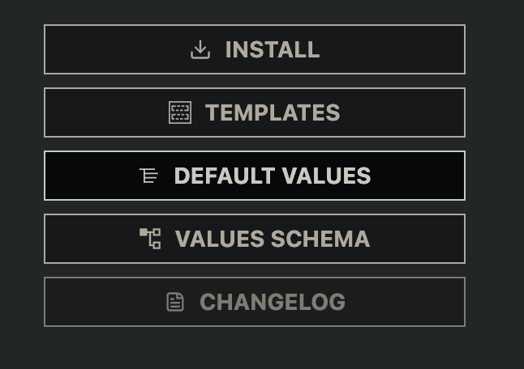
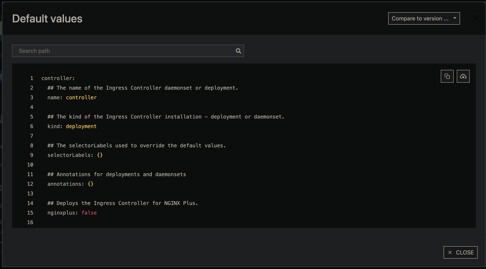
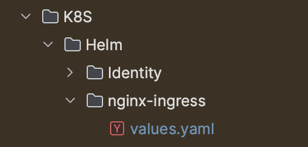
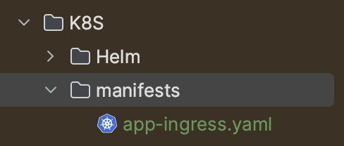
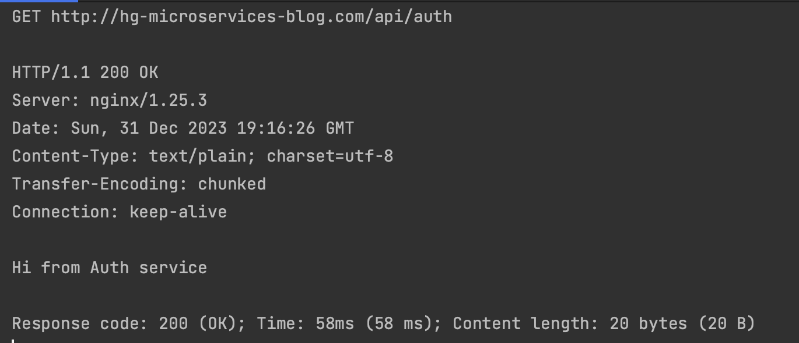
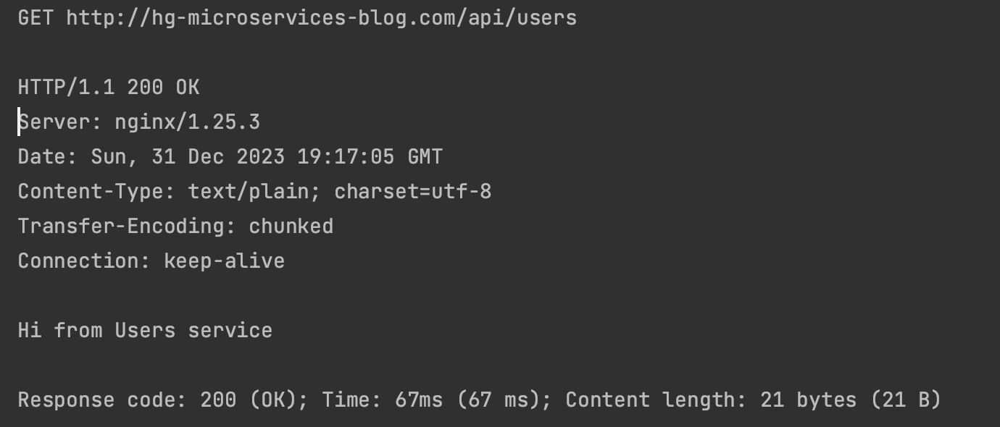
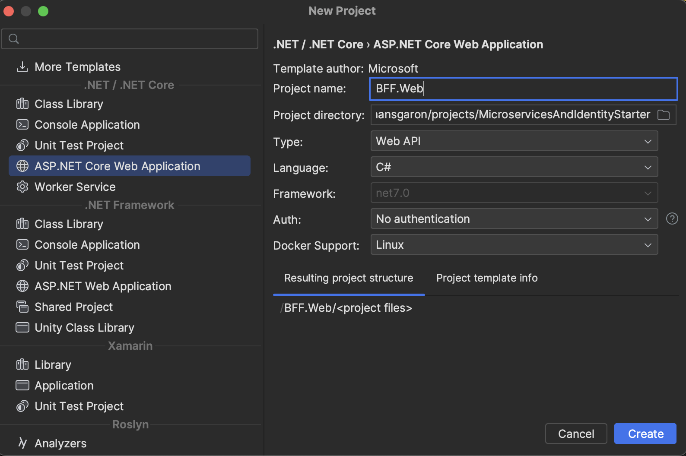
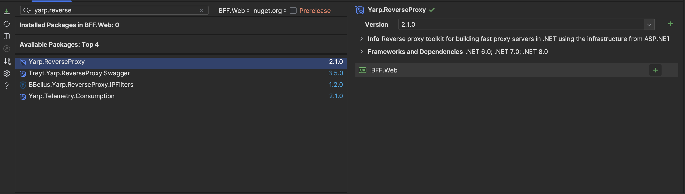
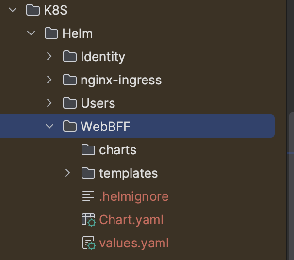

## Ingress -- Letting Outsiders In

Right now we have a local Kubernetes cluster, but no way to access the services within. In order to allow requests originating outside of our cluster to be served by services within our cluster, we will deploy an Ingress object using `ingress-nginx` and Helm.

> A Kubernetes Ingress is a resource that manages external access to the services in a Kubernetes cluster, typically HTTP and HTTPS traffic. It provides routing rules to direct traffic to different services based on the request URL or host header.

But we will go one step further; we don't want our services to be directly exposed to clients. Instead, we will set up infrastructure to support a [backend for frontend pattern](https://learn.microsoft.com/en-us/azure/architecture/patterns/backends-for-frontends). Basically, we will deploy another service that will sit in between our ingress and our other two services. Right now, this will basically be another reverse proxy (maybe a bit useless...), but this infrastructure will serve us well as our application grows and we need to do request aggregation, etc... Also, if we wait to do this and do it later, it'll be more annoying because we would have to update a bunch of stuff -- planning ahead and doing it now will make life easier.

When we are done, our cluster will look something like this:



## GOALS

- Deploy ingress-nginx into our local cluster
- Add a BFF service (reverse proxy) implemented for a web frontend with YARP
  - Right now, we don’t have any requests to aggregate, so this will just be a reverse proxy for now
  - Having this infrastructure in place will allow us to extend it later on with lower overhead


## Ingress Nginx and Helm

We will be using `ingress-nginx` because, well, it's what all the cool kids do. We have two options:

- [Install the Chart via OCI Registry](https://docs.nginx.com/nginx-ingress-controller/installation/installing-nic/installation-with-helm/#managing-the-chart-via-oci-registry)
  - ie. have Skaffold fetch the chart so we don't store it locally
- [Manage the Chart via Sources](https://docs.nginx.com/nginx-ingress-controller/installation/installing-nic/installation-with-helm/#managing-the-chart-via-sources)
  - ie. pull the chart locally into our `K8S/Helm` folder

There's pros and cons to both of these... but I will choose the former method, [Install the Chart via OCI Registry](https://docs.nginx.com/nginx-ingress-controller/installation/installing-nic/installation-with-helm/#managing-the-chart-via-oci-registry). This will also teach us more about how Skaffold works.



In order to use the remote chart, we will update our `skaffold.yaml` to reference the remote `ingress-nginx` chart. Add the highlighted lines below:

```yaml {hl_lines=["3-11"],linenostart=1}
# ...
deploy:
  helm:
    releases:
      - name: ingress
        namespace: app
        createNamespace: true
        remoteChart: oci://ghcr.io/nginxinc/charts/nginx-ingress
        version: 1.1.0
        valuesFiles:
          - ./K8S/Helm/nginx-ingress/values.yaml
# ...
```

Notice the following:
- We've added a namespace called `app`... we will update our other two deployments to use this namespace as well
- We've set `createNamespace` to `true` since we don't have a `yaml` to generate this namespace for us
- the `remoteChart` points to the location where we can pull the chart
- We've set the `version` of the chart to `1.1.0`
  - Note that this is __not the version of the ingress-nginx component, this is just the version of the CHART__
- We've set a `valuesFiles` property pointing to a local `values` file at `./K8S/Helm/nginx-ingress/values.yaml`

Since we don't yet have that `values` file, create a new `nginx-ingress` foler under `Helm` and we can grab the contents of the [default values file](https://artifacthub.io/packages/helm/nginx/nginx-ingress).





Copy the contents of that file and place it into your own `values.yaml` file under the `nginx-ingress` folder.



Great; let's test this out by defining an `Ingress` object in our cluster and defining some routing rules to our existing services. This will just be temporary, and we will update this shortly. But first... more ground work.

## Ingress, manifests, and Skaffold

Remember when we created a `K8S/Helm` folder because we said we wanted flexibility for other resource definitions later? Well, that time is now. We will create an `Ingress` resource that will need to be deployed with `manifests`. So, create a `manifests` folder as a child of your `K8S` folder, and add an `app-ingress.yaml` file:



Now update the contents of `app-ingress.yaml` with the following:

```yaml
apiVersion: networking.k8s.io/v1
kind: Ingress
metadata:
  name: app-ingress-config
  namespace: app
  annotations:
    nginx.ingress.kubernetes.io/rewrite-target: /
spec:
  ingressClassName: nginx
  rules:
    - host: hg-microservices-blog.com
      http:
        paths:
          - path: /api/auth
            pathType: Prefix
            backend:
              service:
                name: identity
                port:
                  number: 80
          - path: /api/users
            pathType: Prefix
            backend:
              service:
                name: users
                port:
                  number: 80
```

This will allow us to make requests which will be directly served by our services. Let's test this in a minute, but first -- let's re-organize skaffold files into __modules__.

### SKAFFOLD BUG ALERT




During writing of this blog, I've discovered a [bug with skaffold modules](https://github.com/GoogleContainerTools/skaffold/issues/9233). As a result, a lot of the configuration we are doing now is kind of pointless... *sigh*. But, when this bug is fixed, this is the right way to manage multiple configurations.

Since we are only dealing with one (local) environment at the moment, this will be ok. But when it comes time to deploy this bug needs fixing or we will need to take a different approach. Fingers crossed Google fixes this bug. Please [bump the gihub issue](https://github.com/GoogleContainerTools/skaffold/issues/9233) to give it some extra traction.


## Reorgainze Skaffold Into Modules

There's a lot of pain and wasted time here for me; so rather than going through all the details we will try to go a bit quickly:

- create a `K8S/skaffold` folder and move your root `skaffold.yaml` file into that folder
- create a folder for each environment we want to target inside `skaffold`, and create a `skaffold.yaml` file in each of them, as well as a `common` folder with a `skaffold.yaml`.
  - `K8S/skaffold/common/skaffold.yaml`
  - `K8S/skaffold/local/skaffold.yaml`
  - `K8S/skaffold/dev/skaffold.yaml`
  - `K8S/skaffold/stage/skaffold.yaml`
  - `K8S/skaffold/prod/skaffold.yaml`

You should end up with something like this:

```shell
.
├── K8s
│   └── Helm
│   └── manifests
│   └── skaffold
│     └── common
│       └── skaffold.yaml
│     └── dev
│       └── skaffold.yaml
│     └── local
│       └── skaffold.yaml
│     └── prod
│       └── skaffold.yaml
│     └── stage
│       └── skaffold.yaml
│     └── skaffold.yaml
```

Replace the contents with the following:

```yaml
# common/skaffold.yaml
apiVersion: skaffold/v4beta8
kind: Config
metadata:
  name: common-config
build:
  artifacts:
    - image: hcgaron/identity-service-starter
      context: ../../../
      docker:
        dockerfile: Identity.Service/Dockerfile
    - image: hcgaron/users-service-starter
      context: ../../../
      docker:
        dockerfile: Users.Service/Dockerfile
manifests:
  rawYaml:
    - ../../manifests/*
deploy:
  helm:
    releases:
      - name: nginx-ingress
        namespace: app
        createNamespace: true
        remoteChart: oci://ghcr.io/nginxinc/charts/nginx-ingress
        version: 1.1.0
        valuesFiles:
          - ../../Helm/nginx-ingress/values.yaml
      - name: identity
        namespace: app
        createNamespace: true
        setValueTemplates:
          image.repository: "{{.IMAGE_REPO_hcgaron_identity_service_starter}}"
          image.tag: "{{.IMAGE_TAG_hcgaron_identity_service_starter}}@{{.IMAGE_DIGEST_hcgaron_identity_service_starter}}"
        setValues:
          image.pullPolicy: "IfNotPresent"
        chartPath: ../../Helm/Identity
        valuesFiles:
          - ../../Helm/Identity/values.yaml
        version: 0.1.0
      - name: users
        namespace: app
        createNamespace: true
        setValueTemplates:
          image.repository: "{{.IMAGE_REPO_hcgaron_users_service_starter}}"
          image.tag: "{{.IMAGE_TAG_hcgaron_users_service_starter}}@{{.IMAGE_DIGEST_hcgaron_users_service_starter}}"
        setValues:
          image.pullPolicy: "IfNotPresent"
        chartPath: ../../Helm/Users
        valuesFiles:
          - ../../Helm/Users/values.yaml
        version: 0.1.0
```

```yaml
# dev/skaffold.yaml
apiVersion: skaffold/v4beta7
kind: Config
metadata:
  name: dev-config
requires:
  - path: ../common/skaffold.yaml
profiles:
  - name: dev
    activation:
      - env: ENV=dev
        command: dev
```

```yaml
# local/skaffold.yaml
apiVersion: skaffold/v4beta7
kind: Config
metadata:
  name: local-config
requires:
  - path: ../common/skaffold.yaml
profiles:
  - name: local
    activation:
      - env: ENV=local
        command: dev
```

```yaml
# prod/skaffold.yaml
apiVersion: skaffold/v4beta7
kind: Config
metadata:
  name: prod-config
requires:
  - path: ../common/skaffold.yaml
profiles:
  - name: prod
    activation:
      - env: ENV=prod
```

```yaml
# stage/skaffold.yaml
apiVersion: skaffold/v4beta7
kind: Config
metadata:
  name: stage-config
requires:
  - path: ../common/skaffold.yaml
profiles:
  - name: stage
    activation:
      - env: ENV=stage
```

```yaml
# skaffold/skaffold.yaml
apiVersion: skaffold/v4beta8
kind: Config
metadata:
  name: main-config
#requires:
#  - path: ./local/skaffold.yaml
#    configs: [local-config]
#    activeProfiles:
#      - name: local
#        activatedBy:
#          - local
#  - path: ./dev/skaffold.yaml
#    configs: [dev-config]
#    activeProfiles:
#      - name: dev
#        activatedBy:
#          - dev
#  - path: ./stage/skaffold.yaml
#    configs: [stage-config]
#    activeProfiles:
#      - name: stage
#        activatedBy:
#          - stage
#  - path: ./prod/skaffold.yaml
#    configs: [ prod-config ]
#    activeProfiles:
#      - name: prod
#        activatedBy:
#          - prod   
profiles:
  - name: local
    manifests:
      rawYaml:
        - ./K8S/manifests/*
    activation:
      - command: dev
      - env: ENV=local
  - name: dev
    requiresAllActivations: true
    manifests:
      rawYaml:
        - ./K8S/manifests/*
    activation:
      - command: dev
      - env: ENV=dev
  - name: stage
    manifests:
      rawYaml:
        - ./K8S/manifests/*
    activation:
      - env: ENV=stage
  - name: prod
    manifests:
      rawYaml:
        - ./K8S/manifests/*
    activation:
      - env: ENV=prod

build:
  artifacts:
    - image: hcgaron/identity-service-starter
      context: .
      docker:
        dockerfile: Identity.Service/Dockerfile
    - image: hcgaron/users-service-starter
      context: .
      docker:
        dockerfile: Users.Service/Dockerfile
deploy:
  helm:
    releases:
      - name: nginx-ingress
        namespace: app
        createNamespace: true
        remoteChart: oci://ghcr.io/nginxinc/charts/nginx-ingress
        version: 1.1.0
        valuesFiles:
          - ./K8S/Helm/nginx-ingress/values.yaml
      - name: identity
        namespace: app
        createNamespace: true
        setValueTemplates:
          image.repository: "{{.IMAGE_REPO_hcgaron_identity_service_starter}}"
          image.tag: "{{.IMAGE_TAG_hcgaron_identity_service_starter}}@{{.IMAGE_DIGEST_hcgaron_identity_service_starter}}"
        setValues:
          image.pullPolicy: "IfNotPresent"
        chartPath: ./K8S/Helm/Identity
        valuesFiles:
          - ./K8S/Helm/Identity/values.yaml
        version: 0.1.0
      - name: users
        namespace: app
        createNamespace: true
        setValueTemplates:
          image.repository: "{{.IMAGE_REPO_hcgaron_users_service_starter}}"
          image.tag: "{{.IMAGE_TAG_hcgaron_users_service_starter}}@{{.IMAGE_DIGEST_hcgaron_users_service_starter}}"
        setValues:
          image.pullPolicy: "IfNotPresent"
        chartPath: ./K8S/Helm/Users
        valuesFiles:
          - ./K8S/Helm/Users/values.yaml
        version: 0.1.0
```

### Skaffold Modules Overview

What we just did, if skaffold's bug is fixes soon, was split our skaffold yaml into different profiles (for each environment) and different modules. We have a `common` module for pieces that will apply to all environments.

Unfortunately, due to the bug in skaffold right now, raw manifests aren't getting deployed, so we can't really make use of this setup yet. So, we are still deploying from our main `skaffold/skaffold.yaml`, but we will move forward with this setup when the skaffold bug is fixed.

## New skaffold dev command

Note you'll have to run `skaffold dev` from the root of your project as before, but be sure to tell it which file to run. You'll need the following:

```sh
skaffold dev -f ./K8S/skaffold/skaffold.yaml
```

Run it now and verify it's working. When it's running, open a new terminal and run `kubectl get ingress -n app` and make sure there is an `Ingress` deployed. Then we can move on below.

## Update hosts File



If you noticed, our `app-ingress.yaml` file has a line like this:

```yaml
- host: hg-microservices-blog.com
```

We need to update our hosts file on our machine so when we visit hg-microservices-blog.com, we are pointed to localhost.

On Mac:

- sudo nano `/etc/hosts`
- add a new line with contents: `127.0.0.1 hg-microservices-blog.com`
- close and save

## Testing Our Services

Run `skaffold dev` and then we can make some GET requests to:

- http://hg-microservices-blog.com/api/auth
- http://hg-microservices-blog.com/api/users

Hopefully you get the correct response from each:



Great! We have our ingress deployed, our skaffold modules up (awaiting a google fix), and our services working! We will supply a TLS certificate to our ingress later (since we are only using http for now).

First, we want to get set up for BFF by deploying a layer between our services and our ingress. In general, we don't want to expose our services directly to clients anyways, so even if we don't need any response aggregation at the moment, this will be a good practice.

## Deploy a YARP Proxy BFF



We will be using [YARP](https://microsoft.github.io/reverse-proxy/) to implement our BFFs. There are many choices of libraries, or we could just make another vanilla web api. The vanially web api route is actually a good choice - but we are using YARP because:
- It'll make pass-through routing simple
- We can use middleware to aggregate requests
- There's no specific reason NOT to
- It's a blog and why not learn a little about YARP so you can use it later?

### Steps To Setup Yarp BFF

- Create a new web api project, with docker support and no authentication



- Add the `Yarp.ReverseProxy` package to your new project



Add a section to your `appsettings.json` file that configures routing:

```json
"ReverseProxy": {
    "Routes": {
      "users-route": {
        "ClusterId": "users-cluster",
        "Match": {
          "Path": "/api/users/{**catch-all}"
        }
      },
      "identity-route": {
        "ClusterId": "identity-cluster",
        "Match": {
          "Path": "/api/auth/{**catch-all}"
        }
      }
    },
    "Clusters": {
      "users-cluster": {
        "Destinations": {
          "destination1": {
            "Address": "http://users:80"
          }
        }
      },
      "identity-cluster": {
        "Destinations": {
          "destination1": {
            "Address": "http://identity:80"
          }
        }
      }
    }
  }
```

- Replace the contents of your `Program.cs` file with the following (note that I left in some of the commented out lines so you can see what was removed -- you can remove the commented lines altogether):

```C#
// Program.cs
var builder = WebApplication.CreateBuilder(args);

// Add services to the container.

builder.Services.AddControllers();
// Learn more about configuring Swagger/OpenAPI at https://aka.ms/aspnetcore/swashbuckle
builder.Services.AddEndpointsApiExplorer();
builder.Services.AddSwaggerGen();

builder.Services
    .AddReverseProxy()
    .LoadFromConfig(builder.Configuration.GetSection("ReverseProxy"));

var app = builder.Build();

// Configure the HTTP request pipeline.
if (app.Environment.IsDevelopment())
{
    app.UseSwagger();
    app.UseSwaggerUI();
}

// app.UseHttpsRedirection();

// app.UseAuthorization();

app.MapControllers();

app.MapReverseProxy();

app.Run();
```

### Subdomain Routing for BFF

We need a way to differentiate client requests that arrive at our ingress so we know which BFF to hit. Right now we have only one BFF called `web`, but we will eventually make `web` and `mobile`.

We will differentiate these by subdomain, so `web.hg-microservices-blog.com` will hit the `web` BFF and `mobile.hg-microservices-blog.com` will hit the `mobile` BFF. There are other approaches like path prefixes, custom headers, etc... but this is a common and good practice.

Go update your hosts file and add the `web` subdomain:

- `sudo nano /etc/hosts`
- add the line `127.0.0.1 web.hg-microservices-blog.com`
- save and exit

Update the `host` field in your `app-ingress.yaml` to use the custom subdomain:

```yaml
- host: web.hg-microservices-blog.com
```

Add a new `Helm` chart for your new BFF called `WebBFF`:



Update `Chart.yaml` to have a valid `name` property:

`name: webbff`

Update the `image` property in `values.yaml` for the new chart:

```yaml
image:
  repository: hcgaron/web-bff-starter
```

Update the `livenessProbe` and `readinessProbe` in your `deployment.yaml` for your new chart:

```yaml
          livenessProbe:
            httpGet:
              path: /api/HealthCheck
              port: http
          readinessProbe:
            httpGet:
              path: /api/HealthCheck
              port: http
```

Add a `HealthCheck.cs` file to your `BFF.Web/Controllers` directory and add the `HealthCheck` controller Kubernetes will use to make sure your service is healthy (or it'll keep shutting down):

```C#
using Microsoft.AspNetCore.Mvc;

namespace BFF.Web.Controllers;

[ApiController]
[Route("api/[controller]")]
public class HealthCheck: ControllerBase
{
    [HttpGet]
    public IActionResult HealthCheckProbe()
    {
        return Ok();
    }
}
```

Add a new `artifact` to your root `skaffold.yaml`:

```yaml
    - image: hcgaron/web-bff-starter
      context: .
      docker:
        dockerfile: BFF.Web/Dockerfile
```

Add a new `Helm` release to your `deploy.helm.releases` section in your `skaffold.yaml`:

```yaml
      - name: webbff
        namespace: app
        createNamespace: true
        setValueTemplates:
          image.repository: "{{.IMAGE_REPO_hcgaron_web_bff_starter}}"
          image.tag: "{{.IMAGE_TAG_hcgaron_web_bff_starter}}@{{.IMAGE_DIGEST_hcgaron_web_bff_starter}}"
        setValues:
          image.pullPolicy: "IfNotPresent"
        chartPath: ./K8S/Helm/WebBFF
        valuesFiles:
          - ./K8S/Helm/WebBFF/values.yaml
        version: 0.1.0
```

I think I covered it all, but there were a lot of steps... run `skaffold dev` now to see if there's any issue. If there is, you can always [email me](mailto:hcgaron@gmail.com) with the error and I'll try to update the steps appropriately.

## Test the BFF

You should now be able to make requests to `http://web.hg-microservices-blog.com/api/auth` and `http://web.hg-microservices-blog.com/api/users` and get the expected responses from each service.

## Next Steps

We finally have some good infrastructure! We still need to set up TLS for our ingress so we can serve https requests, but we will do that a bit later. The next step is to finally use `linkerd` to inject sidecar proxies and use `mTLS` to secure traffic within our cluster. Let's go!

