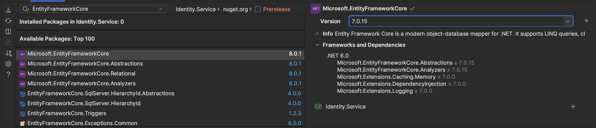

## Motivation

If you're following this series, we have a solid K8S architecture and local dev environment set up; now it's time to get into what (almost) every application needs: authentication.

This is not just a run of the mill auth setup we are going for; we have some lofty goals here. We want to support several different login flows:

- username / password
- OIDC external providers
- 2FA
- etc...

In general, these are common flows and there's nothing lofty or special about them, but we do want to keep the specifics of any federated login outside of our client applications and handle all of the login flows from this auth service. That means our authentication service will be acting as a __federation gateway__, which will handle all the coordination of federated logins (as well as non-federated ones for now), and abstract that from any consumers of our api.

On top of that, we want to have our auth service issue its own JWTs rather than use tokens provided from some federated service. This will allow for better control over the payload in the JWT, and specifically the claims available. It'll also make it easy for us to actually authenticate users at our BFF (or ingress if we wanted) since we will know all the requisite JWT values (issuer, audience, secret) required to do so.

But that's not all! We also want to make sure that when new users are signed up, we can create a new user in the `Auth` service, as well as in our `Users` service. If a user signs up with the same email from multiple federated providers, we want to be able to link all of those to one single user.

There's probably more, but the last one I'll mention for now is that while we will start by just doing simple email / password login & issuing JWTs, we would like to later have our own federated auth server manage users that aren't federated through some other identity provider. Our application will still have its own `Auth` users and will issue its own tokens, but we want to federate all our authentication outside our app eventually. This is for down the road after we have our basic working setup.


It's not necessary to set up your own OAuth2 & OIDC server. You can follow along and this will be an excellent setup for any microservices application with robust authentication needs, even without federating every login. This article is part of a series, which is really to chronicle my journey and provide reading for insomniacs who have been advised against taking Ambien, so I tend to give a broader picture of an architecture than just what a single service might provide.




## Goals

In this article we will do the ground work of setting up a dotnet microservice for authentication:

- Add [Entity Framework Core](https://learn.microsoft.com/en-us/ef/core/) to our project
- Add PostgreSQL to our application to store our `Auth` users
  - Update local K8S with Persistent Volume and Persistent Volume Claim for this purpose
- Add a __soft delete__ strategy to our application
- enable issuing JWT auth tokens
  - We will use a secret in our K8S cluster to be able to share the JWT secret, so that a different application can validate these JWTs later
- Enable JWT validation in our `Web.BFF` (for those not following along, we want to enable authenticating our JWTs in some other microservice)

That is all we will do in this article. We will break this task into several articles and add many more features:

- adding users with email / password
- refresh tokens
- revoking tokens
- federated login
- async messaging to integrate with other microservices

But these are out of the scope of this article. Let's take it in bite size pieces. Here we go!

<!-- ## Overview -->

## Add Entity Framework Core

This is simple; we will use NuGet to add EFCore to our `Identity.Service` project:

(Note that I'm still on .NET 7 even though .NET 8 is out. I'll update soon I'm sure, but no use in switching it up now mid-saga).

