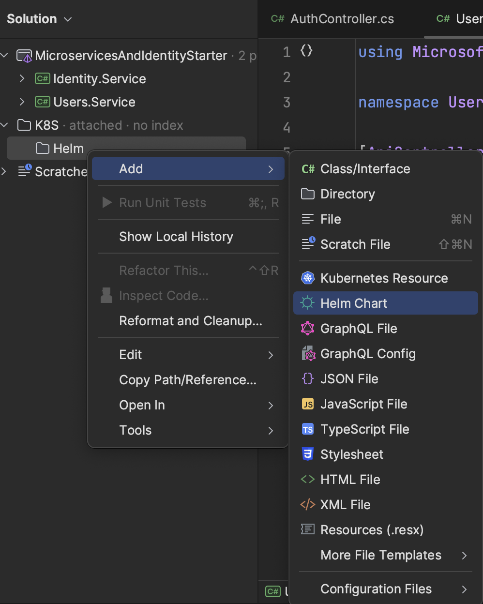
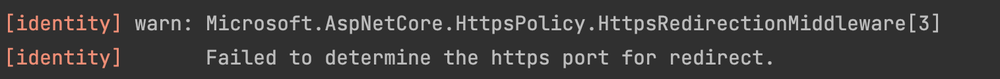

## Goals

As a review, here are our goals for this section:

We have everything we need to begin our journey. Let's be clear about the first goals we want to achieve:
- Create two independent web api microservices
  - These will begin by only serving static content with no database; we will expand them later
- Dockerize these two microservices
- Create Kubernetes manifests for these two microservices
  - This will be done by creating HELM charts for these two microservices
- Initialize Skaffold with `skaffold init` cli command
- Update our `skaffold.yaml` to work with helm
- Deploy these two microservices to our local K8S cluster

## Create Two Web APIs

This will be simple; I'll be executing in Rider, but regardless of your IDE you can take similar steps. Images will be pictured from Rider:

- Create a new solution called `MicroservicesAndIdentityStarter` to hold our microservices for this project


- Create two new web api projects:
  - `Identity.Service`
    - Will be our central location for handling token authentication
    - Will delegate to external auth providers as needed
    - Will provide ability for users to create accounts via email / password
  - `Users.Service`
    - Will be where we keep non-auth related user profiles for our main application

At the time of writing .NET 8 is released, however I'll be developing in .NET 7 and will update later (for expediency). You should have no issue starting straight away from .NET 8 though.

Be sure to choose `No Authentication`. Also, selecting `Docker Support` as `Linux` will dockerize these services out of the box:


## Update Web APIs To Serve Different Content

We won't be building any logic into these services yet; we will do that later. But we will test our different services and want to differentiate them based on their output. So, we will update them to serve different static content so we can tell which service we are hitting based in the response. __This is necessary because we will set up an ingress / api gateway and want to be sure the gateway is hitting the correct service__.

For both services:

- Delete the default `WeatherForecast.cs` model that was generated by app bootstrapping
- Delete the default `WeatherForecastController.cs` controller that was generated by app bootstrapping

### `Identity.Service`

- Create a new controller in the `Controllers` folder called `AuthController.cs`

```C#
using Microsoft.AspNetCore.Mvc;

namespace Identity.Service.Controllers;

[ApiController]
[Route("api/[controller]")]
public class AuthController : ControllerBase
{
    [HttpGet]
    public async Task<IActionResult> Get()
    {
        return Ok("Hi from Auth service");
    }
}
```

### `Users.Service`

- Create a new controller in the `Controllers` called `UsersController.cs`

```C#
using Microsoft.AspNetCore.Mvc;

namespace Users.Service.Controllers;

[ApiController]
[Route("api/[controller]")]
public class UsersController : ControllerBase
{
    [HttpGet]
    public async Task<IActionResult> Get()
    {
        return Ok("Hi from Users service");
    }
}
```

Good, now we can differentiate our services based on their response when we test them later on. We will add logic to these later on, but for now this is sufficient.

## Create Kubernetes Manifests

Before we can initialize skaffold, we have to create K8S manifests. Since we will be using `Helm` to deploy our applications to K8S, we will create one Helm chart for each service. Helm then renders these charts to regular K8S manifests later.

Feel free to keep these K8S manifests wherever you want, but I will keep them in a folder called `K8S/Helm` that will be a peer of the folders containing each application. I will then add this folder to my current solution. The process for doing this while working in Rider is as follows (note that commands from command line are for unix operating systems):

- Open terminal at the root of your solution
- run `mkdir -p K8S/Helm` (the `-p` parameter signals the command to make parent directories)
- Right click on the solution name in Rider --> choose `Add` -> `Existing Folder`

- Add the K8S folder to the solution
  - Don't add the child `Helm` folder directly, as we want to keep the flexibility to add any other K8S manifests here later on in some other directory
- Right click on `Helm` -> `Add` -> `Helm Chart`

- Create one chart called `Identity`
- Create another chart called `Users`

You should have something that looks like this:


This has created a lot of things for us; the parts we are interested in right now are:
- A Kubernetes __Deployment__
- A Kubernetes __Service__
  - The default created services are of type `ClusterIP` listening on `http` port `80`.

These will be created for each application but we have to update `values.yaml` to deploy the correct docker image.

### Update values.yaml

I'll assume you're using [Docker Hub](https://hub.docker.com/) to host your charts. For now, I will also assume they are hosted publicly. We can update this to a private registry later, but since this guide is on the internet, there's no reason to keep them private for now. When you start putting your business logic in, you'll want to protect your trade secrets with a private docker registry. That will be covered later on.

If you look in `values.yaml` right now, you'll see the default charts were created to deploy `nginx`:

```yaml
image:
  repository: nginx # <-- We need to change this to our image from docker hub
  pullPolicy: IfNotPresent
  # Overrides the image tag whose default is the chart appVersion.
  tag: ""
```

 We want to deploy our applications instead by changing `image.repository`. Interestingly, *__we don't need to push our image to docker hub while we are working locally; we just need to provide the correct location they will be in when we want to deploy to a cluster that's not on our machine__*.

 Images on docker hub are referenced in the following format:

 `username/image-name`

 So, since my username is `hcgaron`, and I want to call this image `identity-service-starter`, I will update it to `hcgaron/identity-service-starter`.

```yaml
image:
  repository: hcgaron/identity-service-starter
  pullPolicy: IfNotPresent
  # Overrides the image tag whose default is the chart appVersion.
  tag: ""
```

Do the same for the users service `values.yaml` file:
```yaml
image:
  repository: hcgaron/users-service-starter
  pullPolicy: IfNotPresent
  # Overrides the image tag whose default is the chart appVersion.
  tag: ""
```

With this in place, we have enough to initialize `Skaffold`.

## Initialize Skaffold

The Skaffold CLI can do the setup work for us. Open a terminal at the root of your solution and run `skaffold init`.

It'll ask you about the source to build `busybox` because of some tests that were included by default when the helm charts were created. Since we don't want to build from any of these sources locally, choose `None`:


For each individual application, choose `Docker` and the associated service `Dockerfile`. (You can choose `Buildpacks` if you want, but I am using `Docker`):


When it asks you about which builders you want to create K8S resources for, make sure everything is uncheked and hit enter (we want none):


You should now get a preview of your `skaffold.yaml` in the terminal with a prompt `Do you want to write this configuration to skaffold.yaml? (y/N)`.


Choose `y` for yes and you'll see your new file has been created at the root of the solution. Note that in Rider, you have to show hidden files to be able to see it in your directory:


### Fixing Skaffold yaml

You would be forgiven to think you can run `skaffold dev` now and have things deployed into your local K8S cluster. Go ahead and try it (make sure K8S is enabled and running in your Docker Desktop first), and you'll be greeted with an error:


> If you fix this error, you'll be greeted with a few other errors. We will fix them all now...

This error occurs because of the format of the bootstraped .NET `Dockerfile` and the auto generated `skaffold.yaml`, which aren't playing nicely together. We need to change the `build.artifacts` section of our `skaffold.yaml` to reflect that we are running `skaffold dev` at the root of our solution, but the Dockerfiles are in each of the individual services. Update the `build` section of your `skaffold.yaml` to look like this:


```yaml
build:
  artifacts:
    - image: hcgaron/identity-service-starter
      context: . # <-- this line was changed
      docker:
        dockerfile: Identity.Service/Dockerfile # <-- this line was changed
    - image: hcgaron/users-service-starter
      context: . # <-- this line was changed
      docker:
        dockerfile: Users.Service/Dockerfile # <-- this line was changed
```

With these changes, skaffold can build from the root and find the appropriate dockerfiles in each service.

Ready to try it out? NO! Still more problems!

Run `skaffold dev` again to be greeted with this:


This is because we can't have uppercase letters in our helm release names. These were auto generated by skaffold; let's update them to be lowercase. Update the `deploy` section of your `skaffold.yaml` to the following:

```yaml
deploy:
  helm:
    releases:
      - name: identity # <-- this line was changed
        chartPath: K8S/Helm/Identity
        valuesFiles:
          - K8S/Helm/Identity/values.yaml
        version: 0.1.0
      - name: users # <-- this line was changed
        chartPath: K8S/Helm/Users
        valuesFiles:
          - K8S/Helm/Users/values.yaml
        version: 0.1.0
```

Try `skaffold dev` again -- more errors 🫠

### Fixing Helm Charts


This is because helm created a `ServiceAccount` for us with an invalid name (an uppercase letter). To fix this, go to `Chart.yaml` in __both applications__ and change the name from `Identity` to `identity` and `Users` to `users`:

```yaml
apiVersion: v2
name: users # <-- this line was changed
```

```yaml
apiVersion: v2
name: identity # <-- this line was changed
```

If you run `skaffold dev` you'll notice things seem to start up, but your pods will keep dying after 30 seconds or so (eventually everything will be aborted and fail), and you'll see this in your terminal:


This is because the `deployment.yaml` templates in the auto-generated Helm charts each contain a `readinessProbe` and a `livenessProbe` that points to `/`.

The `livenessProbe` is used to check if the container is alive or operational. If the livenessProbe fails, Kubernetes considers the pod unhealthy and attempts to restart it (hence why your pods keep dying / restarting).

On the other hand, the `readinessProbe` is used to check if the container is ready to serve incoming traffic. If the `readinessProbe` fails, Kubernetes isolates the pod, preventing it from receiving more incoming traffic. Once a subsequent probe succeeds, Kubernetes identifies the pod as healthy and resumes incoming traffic flow.

The problem here is we don't serve anything at the `/` path of these services! We have two options:

- implement a health check endpoint in each service and update our probes to point there
- point the probes to our existing endpoints

Let's implement the health check endpoint in each service and point our probes there.

## Health Check Service Endpoints

Create a new controller for each of the services and replate the file contents with the simple controller below (just change the namespace to match whichever app you are in):

```C#
using Microsoft.AspNetCore.Mvc;

namespace Identity.Service.Controllers;

[ApiController]
[Route("api/[controller]")]
public class HealthCheck: ControllerBase
{
    [HttpGet]
    public IActionResult HealthCheckProbe()
    {
        return Ok();
    }
}
```

Now find the `deployment.yaml` file in the `templates` folder of __both__ Helm charts and update the `livenessProbe` and `readinessProbe` sections:

```yaml
          livenessProbe:
            httpGet:
              path: /api/HealthCheck # <-- this line changed
              port: http
          readinessProbe:
            httpGet:
              path: /api/HealthCheck # <-- this line changed
              port: http
```

Run `skaffold dev` again and it will succeed! (Some warnings show up; we'll clean that up in a minute):


This is all we need to start developing! But technically we haven't done all our homework yet. We haven't updated our `skaffold.yaml` to work with `Helm`. I am debating the need for this, depending on what our workflow will be to push to production (we have many options), but let's do one last update to our `skaffold.yaml` to follow the practice they suggest so we are (somewhat) ready for later down the line.

### Update `skaffold.yaml` to work with Helm

The [Skaffold docs](https://skaffold.dev/docs/deployers/helm/#image-configuration) make note on how to configure the image so that Skaffold can track the image being built and tell Helm which image to to use to deploy. This doesn't really matter locally because we are just using the local files and building the images here, but it'll matter upon deploy.

Note that the `image` key must be configured in `skaffold.yaml`. Update the `deploy` section in your `skaffold.yaml` to the following:


Don't forget to [sanitize invalid characters in the setValueTemplates section](https://skaffold.dev/docs/deployers/helm/#sanitizing-the-artifact-name-from-invalid-go-template-characters). That one annoyed me for some time until I figured it out.


```yaml
deploy:
  helm:
    releases:
      - name: identity
        setValueTemplates: # <-- section added
          image.repository: "{{.IMAGE_REPO_hcgaron_identity_service_starter}}"
          image.tag: "{{.IMAGE_TAG_hcgaron_identity_service_starter}}@{{.IMAGE_DIGEST_hcgaron_identity_service_starter}}"
        setValues: # <-- section added
          image.pullPolicy: "IfNotPresent"
        chartPath: K8S/Helm/Identity
        valuesFiles:
          - K8S/Helm/Identity/values.yaml
        version: 0.1.0
      - name: users
        setValueTemplates: # <-- section added
          image.repository: "{{.IMAGE_REPO_hcgaron_users_service_starter}}"
          image.tag: "{{.IMAGE_TAG_hcgaron_users_service_starter}}@{{.IMAGE_DIGEST_hcgaron_users_service_starter}}"
        setValues: # <-- section added
          image.pullPolicy: "IfNotPresent"
        chartPath: K8S/Helm/Users
        valuesFiles:
          - K8S/Helm/Users/values.yaml
        version: 0.1.0
```

Run `skaffold dev`, take a deep breath, and tell yourself "life is good!"



## Cleanup

Let's clean up one last thing -- our app currently displays these warnings:


We can turn off these warnings by disabling the HttpsRedirect that was enabled by default for our app, since we will be using linkerd as a sidecar proxy to terminate tls.

In `Program.cs` comment out `app.UseHttpsRedirection()` and we are done!

