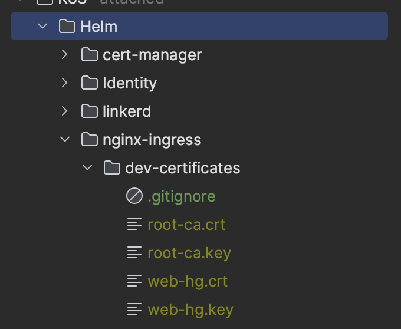
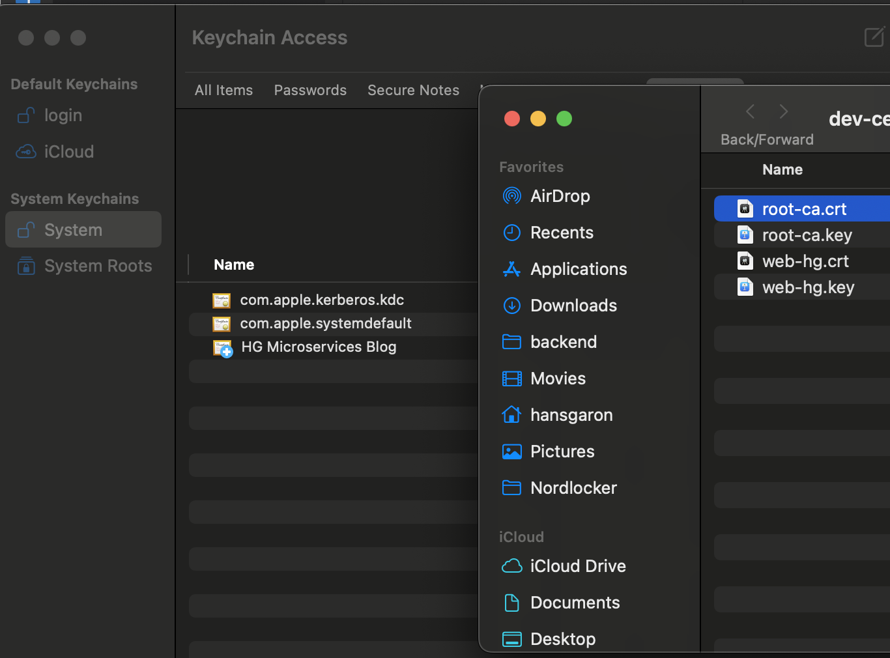

## Motivation

If you've followed along this series, you've done some awesome work -- all our traffic within our cluster is secured and encrypted! But... traffic from the internet (or our local machine) going TO our cluster is NOT encrypted. Truthfully, this is a much bigger vunlerability than if we had left our service-to-service communication unencrypted.

## Goals

We want to set up TLS for our Kubernetes Ingress so that we can LOCALLY access our endpoints on HTTPS. To be honest, we don't *have* to do this on our development environment; it is a bit of overkill. But this is my saga, and if you're following along it's your saga too, so let's go the extra mile and set up a local dev certificate.

Here's a couple of good reasons for us to do it anyways:

- Browsers often won't let us access insecure urls, so we can't use a browser to access our apis
  - Maybe not a huge deal for apis, but if we serve a front end it will be an issue
- We *could* have issues accessing our APIs from another app if we don't support https (if that app runs in a browser especially)
- We are aiming to __have a development environment as close to production as possible__
  - We __MUST__ have a valid certificate and support HTTPS in production, so we should have it here
- We will learn more and be more prepared for deploying to production and won't be left fumbling in the dark later



## Overview

At a high level, here's what we need to do to enable TLS on our Ingress LOCALLY:

- Create a __root certificate__ with `step` that we will have our machine __always trust__
- Use this __root certificate__ to generate other __self signed certificates__ with step, so our machine will always trust any certificate signed with this root certificate
  - We will need to add this root certificate to be trusted by our OS... I'll be using mac, so if you're on something else you'll have to google this step... or just ask Chat GPT
- Create a kubernetes `Secret` with the value of our certificates created in the previous step
- Deploy the secret into our kubernetes cluster
- Update our `Ingress` resource to have a `tls` section which references the secret holding our certificate

This is a little different than what we will need to do in production. When we deploy our app, we can't use self-signed certificates, so we will need a certificate authority like [LetsEncrypt](https://letsencrypt.org/) to issue certificates, and we will use [cert-manager](https://cert-manager.io/) to manage rotating them, etc... In fact, we could even have `cert-manager` generate self-signed certificates for us, but the problem is we want to set up our local certificate once and have it be trusted for a long time (I've set mine for 10 years). If we let cert-manager handle this in our local environment, we will get new certificates every time we re-start skaffold, which will be annoying to work with.

So let's get to it and get secure (locally)!

<!-- 
# Overview in prod
- install `cert-manager` into our cluster with `Helm`
- Create `Issuer` and `Certificate` objects to represent our self-signed certificates
- Create a __root certificate__ with `step` that we will have our machine __always trust__
- Use this __root certificate__ to generate other __self signed certificates__ with step, so our machine will always trust any certificate signed with this root certificate
- Enable skaffold to generate a certificate in a given directory if it doesn't exist when we run `skaffold dev`
- Create a kubernetes `Secret` with the value of our certificates created in the previous step
- Deploy the secret into our kubernetes cluster
- Ensure the `Certificate` object we created for `cert-manager` references this secret -->

<!-- Note that when we deploy to production, we will have a different `Issuer` resource deployed to that cluster and we will have a real certificate authority like [LetsEncrypt](https://letsencrypt.org/) issue certificates.


As with all things, I agonized over what approach to take here. We do have an option to have a "local" certificate created ONCE (perhaps by you or some other team member), and then store that in a secrets manager, and have a script pull that in during deploy to our cluster.

The benefits of this is that we can have our machine trust this certificate once and be done with it (rather than a bunch of rotating certificates, and trusting a root certificate from `step`). But, it seems to add more engineering overhead and, more importantly, adds reliance on external providers (`gcloud`), binaries (`gcloud cli`), accounts, permissions, administrators, etc... It also requires an internet connection to pull the certificate (if you don't currently have it on your machine). This just seemed a bit against the spirit of running things locally... so we are going the route described in the bullet points above.
 -->

## Create Your Local Root and Leaf Certificates

Create a script called `create-root-cert.sh` (yes I'm going Unix here). I have put this script in `./K8S/scripts`, but you can put it anywhere. After you create it, don't forget to `chmod -x create-root-cert.sh` so you will be able to execute it.

I'm going to store my certificates in the `./K8S/Helm/nginx-ingress/dev-certificates` folder (which I have just created).

Inside your script, place this code:

```sh
if [ ! -f ./K8S/Helm/nginx-ingress/dev-certificates/root-ca.crt ]; then
   SCRIPT_DIR=$(dirname "${BASH_SOURCE[0]}")
    step certificate create "HG Microservices Blog" "$SCRIPT_DIR/../Helm/nginx-ingress/dev-certificates/root-ca.crt" "$SCRIPT_DIR/../Helm/nginx-ingress/dev-certificates/root-ca.key" --profile root-ca --kty RSA --size 2048 --no-password --insecure --not-after=87600h # valid for 10 years
    # Change web.hg-microservices-blog.com to your local domain alias in your hosts file
     step certificate create "web.hg-microservices-blog.com" "$SCRIPT_DIR/../Helm/nginx-ingress/dev-certificates/web-hg.crt" "$SCRIPT_DIR/../Helm/nginx-ingress/dev-certificates/web-hg.key" --profile leaf --ca "$SCRIPT_DIR/../Helm/nginx-ingress/dev-certificates/root-ca.crt" --ca-key "$SCRIPT_DIR/../Helm/nginx-ingress/dev-certificates/root-ca.key" --kty RSA --size 2048 --no-password --insecure --san "web.hg-microservices-blog.com" --not-after=87600h # valid for 10 years

else
    echo "Certificate already exists"
fi
```

This code above checks to see if the `root-ca.crt` exists at the specified location. If yes, it will just echo `Certificate already exists`. If no, it'll create a root certificate.

Then, if it created a root certificate, it will also create a __leaf__ certificate, and sign it with the root certificate. Make sure in the second `setp` command you change the `"web.hg-microservices-blog.com"` to your own domain that you specified in your `hosts` file. The `--no-after=87600h` means this certificate will be valid for 10 years.

Now run the script -- you will see 4 new files:



I've also added a `.gitignore` file to this path so these certificates aren't put into version control:

```.gitignore
*.pem
*.crt
*.key
```

After you do this, you'll need to tell your OS to trust the `root-ca.crt`. If you're on a mac open the `Keychain Access` app, select `System` to select your system keychain, and drag in your `root-ca.crt`:



Now you have the cert in there locally, but it's still not trusted. Double click on it, open the `Trust` section at the top, and select `Always Trust`. This is usually insecure, but it's just for our local dev server, so it's ok.


Ok you are set - now let's apply this to our Ingress!

## Create the K8S secret



We need to add a secret in Kubernetes that has the value of your leaf certificate. In your `local/skaffold.yaml`, add this to your `deploy.helm.hooks.before.host` entries:

```yaml
  helm:
    hooks:
      before:
        - host:
            os: [ darwin, linux, arm64 ]
            command: [ "kubectl", "create", "secret", "tls", "web-hg-microservices-blog-com-tls", "--cert=./K8S/Helm/nginx-ingress/dev-certificates/web-hg.crt", "--key=./K8S/Helm/nginx-ingress/dev-certificates/web-hg.key", "-n", "app" ]
```

Yes, I'm abandoning the cross platform stuff. But, you can make this work for your OS easily I'm sure.

The command above creates a K8S secret called `web-hg-microservices-blog-com-tls` and gives it the leaf cert `.crt` and `.key` files. Now we just need to tell our Ingress to use this for tls.

## Add Certificate To Ingress

Update the `spec` section in your `app-ingress.yaml` to look like the following:

```yaml
spec:
  ingressClassName: nginx
  tls:
    - hosts:
        - web.hg-microservices-blog.com
      secretName: web-hg-microservices-blog-com-tls
```

Here we are just setting up `tls`, specifying the same `host` we have in our `hosts` file (the one for which we have made our certificates), and then pointing it to the `secretName` we created above. This will let the Ingress know where to find the certificate, and will allow us to use HTTPS.

And that's it!

Go make some requests in a browser or other client, and you should be able to use https!



## Next Steps

We will need to do more when it comes to securing our Ingress in production. First, we currently have a single `Ingress` definition under `common/manifests`, but we should have an Ingress defined for each environment. This will allow us more flexibility, and also we will need to identify different subdomains for each environment.

Also, in prod we will use `cert-manager` to manage rotating our certificates, and we will use __LetsEncrypt__ to issue certificates. But what we have done here is good enough for our development environment, and as we get to the point where we are wrapping up this Saga, we will make sure all of the above is in good shape.

So... we are on to authentication next! We will start building out this service to allow users to sign in with username and password first (simple), then we will federate out to other OIDC compliant providers.

Go hero, go!