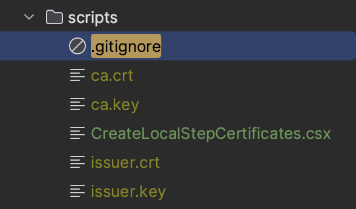

Our hero is entering the world of mesh. Ahead lies secure inter-service communications via mTLS, sidecar proxies, pod injection... let's dive in.

## Goals

We want to secure service to service communication in our cluster via mTLS. To achieve this we will use [linkerd](https://linkerd.io/) to inject sidecar proxies and manage our communication between services.

### Linkerd Overview
Linkerd deploys [sidecar proxies](https://learn.microsoft.com/en-us/azure/architecture/patterns/sidecar) alongside application pods to manage all TCP traffic transparently. It secures service-to-service communication through automatic mutual Transport Layer Security (mTLS), which encrypts and authenticates all TCP traffic between meshed pods without additional work from the user.

Linkerd also offers customizable request policies, allowing us to keep this logic out of our app and in our infrastructure. If you've ever used [polly](https://www.thepollyproject.org/) in your .NET apps, we can replace a lot of that with the features of linkerd, allowing us to clean up our application code a bit more.


## Install Linkerd and `step`

To begin we need to install two tools:

- [linkerd cli](https://linkerd.io/2.14/getting-started/#step-1-install-the-cli)
  - You should only need to do step 1... don't install it into your cluster yet!
  - If you're on mac and use homebrew, run `brew install linkerd`
  - Otherwise, follow the steps on the attached link above
- [step](https://smallstep.com/docs/step-cli/installation)
  - We will use this to generate certificates we need for mTLS
  - If you're on mac and use homebrew, run `brew install step`
  - Otherwise, find your OS in the attached link above

Validate your linkerd installation by running `linkerd version`.


Validate your step installation by running `step version`.


## Use A Cloud Secrets Manager For Storing Certificates

We are going to install linkerd into our cluster using `Helm` (like almost all of our resources), and of course leveraging skaffold. But, using `Helm` to install linkerd does come with a little extra work (*embrace the pain*).

> To do automatic mutual TLS, Linkerd requires trust anchor certificate and an issuer certificate and key pair. When you’re using linkerd install, \[linkerd] can generate these for you. However, for Helm, you will need to generate these yourself.

Got it, we will use `step` which we've already installed to do that (details further in this article). But, linkerd gives instructions (that we will adapt for skaffold) that we must provide the files during installation of the `linkerd-control-plane`:

> helm install linkerd-control-plane \
  -n linkerd \
  --set-file identityTrustAnchorsPEM=ca.crt \
  --set-file identity.issuer.tls.crtPEM=issuer.crt \
  --set-file identity.issuer.tls.keyPEM=issuer.key \
  linkerd/linkerd-control-plane

This is a bit more complicated because these are security certificates which we can't add to version control, and don't want exposed to everyone. So we have a few choices:

### Certificate Creation Options

- Have developers create their own certificates for local development & have CI pull other certificates from a secrets manager
- Upload a set of development certificates to secrets manager and have developers pull it to their local machine (through a manual process)
- Write a script for developers that pulls development certificates from a secrets manager
- Write a script that creates development certificates and run it automatically before each deploy using `skaffold dev`

Yes, that last item will be our approach; it balances sanity with insanity, but more importantly: as long as all the necessary dependencies have been installed on the host machine (`step` is the only dependency), it will work.

But we are at a crossroads here: we need a script that will work across all operating systems we expect to support for development. I would have said "this is for Unix, sorry Windows..." but that's a bad choice for a blog and a general purpose starter app like this since __I've chosen a Microsoft product as my primary programming language and if anyone besides Google bots or ChatGPT ever reads this, it will probably be some .NET developer on Windows__.



So, after agonizing over this decision for a sufficiently long time and re-writing this section at least once (use `bash`... no use `sh`, no no wait -- Node, hmmm...), I've decided to go with a .NET script (duh) because every dev working in this stack should have the .NET runtime available. We will have a `.csx` file that can be invoked with `dotnet-script`.

### Install dotnet-script

Install dotnet-script globally using the .NET CLI:

`dotnet tool install -g dotnet-script`

We should start adding all this stuff to a README so new devs can just pull down, install dependencies, and run the app...

### Add `CreateLocalStepCertificates.csx`


In your `K8S` folder add a new folder `scripts` and create a file called `CreateLocalStepCertificates.csx`. Place the following contents within:


```C#
using System;
using System.Diagnostics;


void Run()
    {
        RunStepCommand("certificate create root.linkerd.cluster.local ca.crt ca.key --profile root-ca --no-password --insecure");
        RunStepCommand("certificate create identity.linkerd.cluster.local issuer.crt issuer.key --profile intermediate-ca --not-after 8760h --no-password --insecure --ca ca.crt --ca-key ca.key");
    }
    
void RunStepCommand(string arguments)
    {
        var processStartInfo = new ProcessStartInfo
        {
            FileName = "step", // Ensure 'step' is in the system's PATH or provide the full path to the binary
            Arguments = arguments,
            RedirectStandardOutput = true,
            RedirectStandardError = true,
            UseShellExecute = false,
            CreateNoWindow = true,
        };

        var process = new Process
        {
            StartInfo = processStartInfo,
        };

        process.Start();

        string output = process.StandardOutput.ReadToEnd();
        string error = process.StandardError.ReadToEnd();
        Console.WriteLine(output);
        if (!string.IsNullOrEmpty(error))
        {
            Console.Error.WriteLine(error);
        }

        process.WaitForExit();
    }

Run();
```

You can test this by navigating to the `scripts` folder and running `dotnet-script CreateLocalStepCertificates.csx`. You should see your new certificates created in the `scripts` directory:

We'll also add this `.gitignore` file to that directory to be sure no certificates ever get into source control:



Now we can add this script to run in the `local` profile our `skaffold.yaml` before each deploy:


- install the linkerd cli
- install `step` and generate the required certificates
- use a secrets manager to store the secrets
  - I'll use google cloud secrets manager
  - install google cloud cli
  - upload secrets
  - export them into environment variables
- update skaffold.yaml helm release with 2 charts
  - linkerd-crds
  - linkerd-control-plane