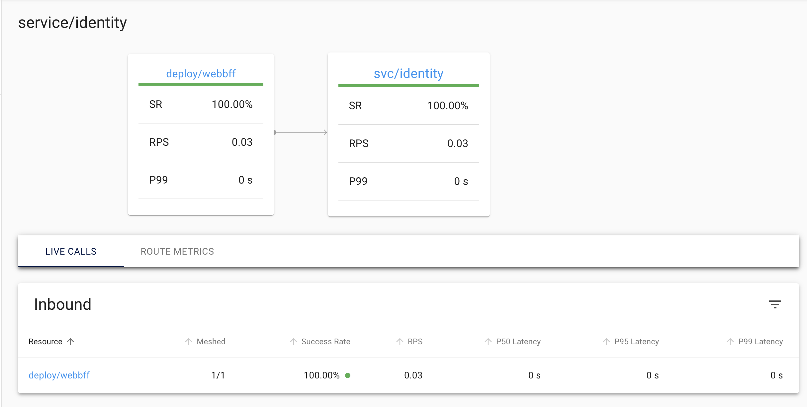

Our hero (that's you if you've stayed awake through any single article of this series) is entering the world of mesh. Ahead lies secure inter-service communications via mTLS, sidecar proxies, pod injection... let's dive in.

## Goals

We want to secure service to service communication in our cluster via mTLS. To achieve this we will use [linkerd](https://linkerd.io/) to inject sidecar proxies and manage our communication between services.

### Linkerd Overview
Linkerd deploys [sidecar proxies](https://learn.microsoft.com/en-us/azure/architecture/patterns/sidecar) alongside application pods to manage all TCP traffic transparently. It secures service-to-service communication through automatic mutual Transport Layer Security (mTLS), which encrypts and authenticates all TCP traffic between meshed pods without additional work from the user.

Linkerd also offers customizable request policies, allowing us to keep this logic out of our app and in our infrastructure. If you've ever used [polly](https://www.thepollyproject.org/) in your .NET apps, we can replace a lot of that with the features of linkerd, allowing us to clean up our application code a bit more.


## Install Linkerd and `step`

To begin we need to install two tools:

- [linkerd cli](https://linkerd.io/2.14/getting-started/#step-1-install-the-cli)
  - You should only need to do step 1... don't install it into your cluster yet!
  - If you're on mac and use homebrew, run `brew install linkerd`
  - Otherwise, follow the steps on the attached link above
- [step](https://smallstep.com/docs/step-cli/installation)
  - We will use this to generate certificates we need for mTLS
  - If you're on mac and use homebrew, run `brew install step`
  - Otherwise, find your OS in the attached link above

Validate your linkerd installation by running `linkerd version`.


Validate your step installation by running `step version`.


## Use A Cloud Secrets Manager For Storing Certificates

We are going to install linkerd into our cluster using `Helm` (like almost all of our resources), and of course leveraging skaffold. But, using `Helm` to install linkerd does come with a little extra work (*embrace the pain*).

> To do automatic mutual TLS, Linkerd requires trust anchor certificate and an issuer certificate and key pair. When you’re using linkerd install, \[linkerd] can generate these for you. However, for Helm, you will need to generate these yourself.

Got it, we will use `step` which we've already installed to do that (details further in this article). But, linkerd gives instructions (that we will adapt for skaffold) that we must provide the files during installation of the `linkerd-control-plane`:

> helm install linkerd-control-plane \
  -n linkerd \
  --set-file identityTrustAnchorsPEM=ca.crt \
  --set-file identity.issuer.tls.crtPEM=issuer.crt \
  --set-file identity.issuer.tls.keyPEM=issuer.key \
  linkerd/linkerd-control-plane

This is a bit more complicated because these are security certificates which we can't add to version control, and don't want exposed to everyone. So we have a few choices:

### Certificate Creation Options

- Have developers create their own certificates for local development & have CI pull other certificates from a secrets manager
- Upload a set of development certificates to secrets manager and have developers pull it to their local machine (through a manual process)
- Write a script for developers that pulls development certificates from a secrets manager
- Write a script that creates development certificates and run it automatically before each deploy using `skaffold dev`

Yes, that last item will be our approach; it balances sanity with insanity, but more importantly: as long as all the necessary dependencies have been installed on the host machine (`step` is the only dependency), it will work. When it comes time to deploy our app, we will have some certificates stored in a secrets manager and have our CI authenticate, download them into our deploy container, and provide them to helm.

But we are at a crossroads here: we need a script that will work across all operating systems we expect to support for development. I would have said "this is for Unix, sorry Windows..." but that's a bad choice for a blog and a general purpose starter app like this since __I've chosen a Microsoft product as my primary programming language and if anyone besides Google bots or ChatGPT ever reads this, it will probably be some .NET developer on Windows__.



So, after agonizing over this decision for a sufficiently long time and re-writing this section at least once (use `bash`... no use `sh`, no no wait -- Node, hmmm...), I've decided to go with a .NET script (duh) because every dev working in this stack should have the .NET runtime available. We will have a `.csx` file that can be invoked with `dotnet-script`.

### Install dotnet-script

Install dotnet-script globally using the .NET CLI:

`dotnet tool install -g dotnet-script`

We should start adding all this stuff to a README so new devs can just pull down, install dependencies, and run the app...

### Add `CreateLocalStepCertificates.csx`


In your `K8S` folder add a new folder `scripts` and create a file called `CreateLocalStepCertificates.csx`. Place the following contents within:


```C#
using System;
using System.Diagnostics;


void Run()
    {
        // Note the use of -f to forcibly overwrite any existing files
        RunStepCommand("certificate create root.linkerd.cluster.local ca.crt ca.key --profile root-ca --no-password --insecure -f");
        RunStepCommand("certificate create identity.linkerd.cluster.local issuer.crt issuer.key --profile intermediate-ca --not-after 8760h --no-password --insecure --ca ca.crt --ca-key ca.key -f");
    }
    
void RunStepCommand(string arguments)
    {
        var processStartInfo = new ProcessStartInfo
        {
            FileName = "step", // Ensure 'step' is in the system's PATH or provide the full path to the binary
            Arguments = arguments,
            RedirectStandardOutput = true,
            RedirectStandardError = true,
            UseShellExecute = false,
            CreateNoWindow = true,
            WorkingDirectory = "./K8S/Helm/linkerd"
        };

        var process = new Process
        {
            StartInfo = processStartInfo,
        };

        process.Start();

        string output = process.StandardOutput.ReadToEnd();
        string error = process.StandardError.ReadToEnd();
        if (!string.IsNullOrEmpty(error))
        {
            Console.Error.WriteLine(error);
        }

        process.WaitForExit();
    }

Run();
```

Go create an empty `./K8S/Helm/linkerd` directory and add a new `.gitignore` file to it, then add these lines as its contents:
```
*.crt
*.key
```

We will keep our `values.yaml` file for linkerd here and our generated local certificates here. We don't want those certificates for development to get into version control.

You can test generating certificates by navigating to the root of your solution and running `dotnet-script ./K8S/scripts/CreateLocalStepCertificates.csx`. You should see your new certificates created in the `./K8S/Helm/linkerd` directory:


Now we can add this script to run in the `local` profile our `skaffold.yaml` before each deploy:

```yaml
# local/skaffold.yaml
# ...
deploy:
  helm:
    hooks:
      before:
        - host:
            command: [ "dotnet-script", "./K8S/scripts/CreateLocalStepCertificates.csx" ]
# ...
```

As you can see above, Skaffold allows us to add `hooks` to our helm deployments (and other deployers), both on `before` and on `after` our deployments. Since this profile is only invoked locally, these scripts will only be run when we are on our local environment.




## Preparing our Deployments and Namespace for Automatic Meshing / linkerd Injection

Remember how we said `linkerd` will __inject__ sidecar proxies into the pods with your app containers and mesh them together? That process goes a bit like this (in theory):

- create the `linkerd` namespace in your cluster
- annotate any namespaces containing components you want auto-meshed with `linkerd.io/inject=enabled`
- Deploy 2 charts into your cluster:
  - `linkerd/linkerd-crds`
  - `linkerd/linkerd-control-plane`
    - provide your mTLS required certificates at this step
- deploy your other resources (Deployments, Pods, StatefulSet, etc...), be sure they are also annotated with `linkerd.io/inject=enabled`
- linkerd will automatically inject into the annotated resources and you are good to go

In theory that sounds great... IN THEORY.



In reality, at least in our local dev environment, it's more painful than that for several reasons:

- If we don't __wait for linkerd to be fully deployed__ before our other apps are deployed, our pods will not be automatically injected / meshed
- If we DO try to sequence our Helm releases by using `wait: true` (ie, the `--wait` flag to the helm CLI) when we run `skaffold dev`, our linkerd components will be deployed before our other apps...
- BUT, the control plane may not be ready to inject linkerd into pods. In practice, this has caused the next deployment after linkerd to time out and `skaffold dev` will fail after a long wait

So, to get our deployments meshed locally, it seems like we have to let everything deploy concurrently, not be meshed, and then restart all the deployments in our `app` namespace which will kill and "reschedule" our pod. When the new pod starts up, it'll be successfully meshed.

Now in production, you likely won't often (ever?) be nuking an entire cluster unless you are doing something drastic, so it's not such a big deal to do this on a production cluster, since when linkerd is finally deployed and ready, all subsequent deployments / restarts of a pod will be meshed successfully. But locally, we have to hack it. We can do that in the `deploy.helm.hooks.after` section of our `local/skaffold.yaml`.

```yaml
      after:
        - host:
            command: [ "sh", "-c", "for deployment in $(kubectl get deployments -n app -o name); do kubectl rollout restart $deployment -n app; done" ]
```

This will basically restart our pods in the `app` namespace as soon as our deployments are done, then on restart they will be meshed.

We are almost there, hang with me and we will reach victory soon...

## Install linkerd-viz chart

So how are we supposed to know that our services are meshed / secure? Blind faith? That's how software works, right?

If you're talking about LLMs, the answer is pretty much "yes". But not for linkerd... we can install another chart `linkerd/linkerd-viz` which will allow us to run `linkerd viz dashboard` and will open a web UI dashboard showing us metrics.


It's meshed! Oh god, it's finally meshed!



How cool is this, it even shows us which services are communicating, etc...




## Pulling It All Together

Let's review the steps IN THEROY, and then we'll run down all the things to change in the code that got this working. Lastly, we'll cover a couple of the bugaboos that we need to address during development or in production.

### In Theory

- create the `linkerd` namespace in your cluster
- annotate any namespaces containing components you want auto-meshed with `linkerd.io/inject=enabled`
- Deploy 2 charts into your cluster:
  - `linkerd/linkerd-crds`
  - `linkerd/linkerd-control-plane`
    - provide your mTLS required certificates at this step
- deploy your other resources (Deployments, Pods, StatefulSet, etc...), be sure they are also annotated with `linkerd.io/inject=enabled`
- `rollout restart` all your deployments in your `app` namespace
- linkerd will automatically inject into the annotated resources and you are good to go

### In Practice

__Locally Only__
- create dev certificates for mTLS
Do this in `local/skaffold.yaml`:
```yaml {hl_lines=["4-7"],linenostart=1}
# ...
deploy:
  helm:
    hooks:
      before:
        - host:
            command: [ "dotnet-script", "./K8S/scripts/CreateLocalStepCertificates.csx" ]
# ...
```

__All Environments__
- create the `linkerd` namespace in your cluster

Do this in your `common/skaffold.yaml`:

```yaml {hl_lines=["4-8"],linenostart=1}
# ...
  helm:
    hooks:
      before:
        - host:
            command: [ "sh", "-c", "kubectl create namespace linkerd --dry-run=client -o yaml | kubectl apply -f -" ]
        - host:
            command: [ "kubectl", "label", "namespace", "kube-system", "config.linkerd.io/admission-webhooks=disabled", "--overwrite" ]
# ...
```
Note: we also are labelming the `kube-system` namespace [per the linkerd docs](https://linkerd.io/2.14/features/ha/#exclude-the-kube-system-namespace).

- annotate any namespaces containing components you want auto-meshed with `linkerd.io/inject=enabled`

Do this in your `common/skaffold.yaml`:
```yaml {hl_lines=["9-12"],linenostart=1}
# ...  
  helm:
    hooks:
      before:
        - host:
            command: [ "sh", "-c", "kubectl create namespace linkerd --dry-run=client -o yaml | kubectl apply -f -" ]
        - host:
            command: [ "kubectl", "label", "namespace", "kube-system", "config.linkerd.io/admission-webhooks=disabled", "--overwrite" ]
        - host:
            command: [ "sh", "-c", "kubectl create namespace app --dry-run=client -o yaml | kubectl apply -f -" ]
        - host:
            command: [ "kubectl", "annotate", "namespace", "app", "linkerd.io/inject=enabled", "--overwrite"]
# ...
```
Do this to `Users/values.yaml`, `Identity/values.yaml`, `nginx-ingress/values.yaml`, `WebBFF/values.yaml`:
```yaml
podAnnotations:
  linkerd.io/inject: enabled
```

- Deploy 2 charts into your cluster:
  - `linkerd/linkerd-crds`
  - `linkerd/linkerd-control-plane`
    - provide your mTLS required certificates at this step

Do this to `common/skaffold.yaml`:
```yaml
#...
    releases:
      - name: linkerd-service-mesh
        namespace: linkerd
        repo: https://helm.linkerd.io/stable
        remoteChart: linkerd-crds
      - name: linkerd-control-plane
        namespace: linkerd
        repo: https://helm.linkerd.io/stable
        remoteChart: linkerd-control-plane
        valuesFiles:
          - ../../Helm/linkerd/values.yaml
        setFiles:
          identityTrustAnchorsPEM: ../../Helm/linkerd/ca.crt
          identity.issuer.tls.crtPEM: ../../Helm/linkerd/issuer.crt
          identity.issuer.tls.keyPEM: ../../Helm/linkerd/issuer.key
#...
```

Note that when deploying to production, we won't be using skaffold (most likely), but your certificates will need to be fetched from a secrets manager before this step and placed in the correct directory in the deploy runner container.

- deploy your other resources (Deployments, Pods, StatefulSet, etc...), be sure they are also annotated with `linkerd.io/inject=enabled`

This should be done since we already have everything annotated and set to deploy in skaffold already.

- `rollout restart` all your deployments in your `app` namespace

Do this in `local/skaffold.yaml`:

```yaml {hl_lines=["4-6"],linenostart=1}
  helm:
    hooks:
    # ...
      after:
        - host:
            command: [ "sh", "-c", "for deployment in $(kubectl get deployments -n app -o name); do kubectl rollout restart $deployment -n app; done" ]
```

### Optional (but not really)

- Add `linkerd-viz` namespace

Do this in `local/skaffold.yaml`

```yaml {hl_lines=["5-8"],linenostart=1}
# ...
    hooks:
      before:
        #...
        - host:
            command: [ "sh", "-c", "kubectl create namespace linkerd-viz --dry-run=client -o yaml | kubectl apply -f -" ]
        - host: 
            command: [ "kubectl", "label", "namespace", "linkerd-viz", "linkerd.io/extension=viz", "--overwrite" ]
# ...
```

Run `linkderd viz dashboard` and check out the amazing thing you just did. Good going mesh hero.




## Notes

There are some concessions I made when going through this:

- I wanted to have all the scripts we are running be cross platform... but I just bailed on that
- Just use Unix, WSL, Mac, Linux, whatever. Don't make things harder by going straight up windows and making me work harder for no reason.
- We still need to handle prod scenarios for creating certificates and deploying
- We had to restart all our deployments after `skaffold dev` because, well, life is hard. But we did it

## Next Steps

Next we will do a little re-organizing of our dockerfiles to keep skaffold from rebuilding so much. Then it's on to handling authentication. We are DEEP in it now!